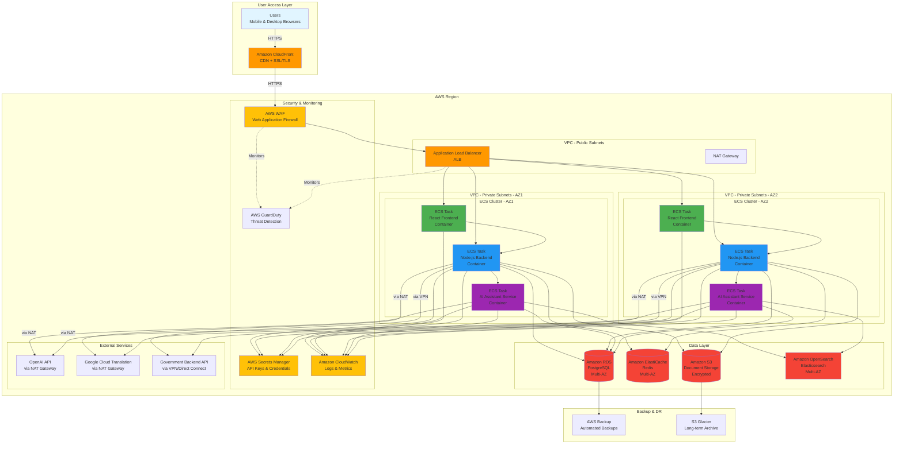

# AGAA System - AWS Architecture Diagram

This document contains the AWS cloud architecture for the AI-Powered Government Application Assistant (AGAA) system.

## AWS Architecture Overview

---

## Detailed AWS Architecture with Services

```mermaid
graph TB
    subgraph "Edge Layer"
        Route53[Amazon Route53<br/>DNS Management]
        CloudFront[Amazon CloudFront<br/>- Global CDN<br/>- SSL/TLS Termination<br/>- DDoS Protection]
        WAF[AWS WAF<br/>- SQL Injection Protection<br/>- XSS Protection<br/>- Rate Limiting]
    end
    
    subgraph "AWS Region: ap-south-1 Mumbai"
        subgraph "Availability Zone 1"
            subgraph "Public Subnet AZ1"
                ALB1[Application Load Balancer<br/>Target Group 1]
                NAT1[NAT Gateway 1]
            end
            
            subgraph "Private Subnet AZ1 - Compute"
                ECS1[Amazon ECS Fargate<br/>Frontend Tasks]
                ECS2[Amazon ECS Fargate<br/>Backend API Tasks]
                ECS3[Amazon ECS Fargate<br/>AI Service Tasks]
            end
            
            subgraph "Private Subnet AZ1 - Data"
                RDS1[(RDS PostgreSQL<br/>Primary Instance)]
                Redis1[(ElastiCache Redis<br/>Primary Node)]
            end
        end
        
        subgraph "Availability Zone 2"
            subgraph "Public Subnet AZ2"
                ALB2[Application Load Balancer<br/>Target Group 2]
                NAT2[NAT Gateway 2]
            end
            
            subgraph "Private Subnet AZ2 - Compute"
                ECS4[Amazon ECS Fargate<br/>Frontend Tasks]
                ECS5[Amazon ECS Fargate<br/>Backend API Tasks]
                ECS6[Amazon ECS Fargate<br/>AI Service Tasks]
            end
            
            subgraph "Private Subnet AZ2 - Data"
                RDS2[(RDS PostgreSQL<br/>Standby Instance)]
                Redis2[(ElastiCache Redis<br/>Replica Node)]
            end
        end
        
        subgraph "Shared Services"
            S3Docs[S3 Bucket<br/>Documents<br/>- Versioning Enabled<br/>- Encryption at Rest]
            S3Static[S3 Bucket<br/>Static Assets<br/>- Public Read<br/>- CloudFront Origin]
            S3Backup[S3 Bucket<br/>Backups<br/>- Lifecycle Policies<br/>- Glacier Transition]
            
            OpenSearch[Amazon OpenSearch<br/>- 3 Master Nodes<br/>- 2 Data Nodes<br/>- Multi-AZ]
            
            ECR[Amazon ECR<br/>Container Registry<br/>- Frontend Image<br/>- Backend Image<br/>- AI Service Image]
            
            Secrets[AWS Secrets Manager<br/>- DB Credentials<br/>- API Keys<br/>- JWT Secrets]
            
            KMS[AWS KMS<br/>Encryption Keys<br/>- S3 Encryption<br/>- RDS Encryption<br/>- Secrets Encryption]
        end
        
        subgraph "Monitoring & Security"
            CloudWatch[Amazon CloudWatch<br/>- Logs<br/>- Metrics<br/>- Alarms<br/>- Dashboards]
            
            XRay[AWS X-Ray<br/>Distributed Tracing]
            
            GuardDuty[AWS GuardDuty<br/>Threat Detection]
            
            SecurityHub[AWS Security Hub<br/>Security Posture]
            
            IAM[AWS IAM<br/>- Roles<br/>- Policies<br/>- Service Accounts]
        end
        
        subgraph "CI/CD Pipeline"
            CodePipeline[AWS CodePipeline<br/>Deployment Pipeline]
            CodeBuild[AWS CodeBuild<br/>Build & Test]
            CodeDeploy[AWS CodeDeploy<br/>ECS Deployment]
        end
    end
    
    subgraph "External Integrations"
        OpenAI[OpenAI API<br/>GPT-4]
        GoogleTranslate[Google Cloud<br/>Translation API]
        GovAPI[Government Backend<br/>Submission API]
        SMS[SMS Gateway<br/>Twilio/AWS SNS]
        Email[Email Service<br/>AWS SES]
    end
    
    Route53 --> CloudFront
    CloudFront --> WAF
    WAF --> ALB1
    WAF --> ALB2
    
    ALB1 --> ECS1
    ALB1 --> ECS2
    ALB2 --> ECS4
    ALB2 --> ECS5
    
    ECS1 --> S3Static
    ECS4 --> S3Static
    
    ECS2 --> ECS3
    ECS5 --> ECS6
    
    ECS2 --> RDS1
    ECS5 --> RDS1
    ECS2 --> Redis1
    ECS5 --> Redis1
    ECS2 --> S3Docs
    ECS5 --> S3Docs
    
    ECS3 --> OpenSearch
    ECS6 --> OpenSearch
    ECS3 --> RDS1
    ECS6 --> RDS1
    
    RDS1 -.->|Replication| RDS2
    Redis1 -.->|Replication| Redis2
    
    ECS2 --> Secrets
    ECS5 --> Secrets
    ECS3 --> Secrets
    ECS6 --> Secrets
    
    S3Docs --> KMS
    RDS1 --> KMS
    Secrets --> KMS
    
    ECS3 -->|via NAT1| OpenAI
    ECS6 -->|via NAT2| OpenAI
    ECS2 -->|via NAT1| GoogleTranslate
    ECS5 -->|via NAT2| GoogleTranslate
    
    ECS2 -->|VPN/Direct Connect| GovAPI
    ECS5 -->|VPN/Direct Connect| GovAPI
    
    ECS2 --> SMS
    ECS5 --> SMS
    ECS2 --> Email
    ECS5 --> Email
    
    ECS1 --> CloudWatch
    ECS2 --> CloudWatch
    ECS3 --> CloudWatch
    ECS4 --> CloudWatch
    ECS5 --> CloudWatch
    ECS6 --> CloudWatch
    
    ECS2 --> XRay
    ECS5 --> XRay
    
    RDS1 --> CloudWatch
    Redis1 --> CloudWatch
    OpenSearch --> CloudWatch
    
    GuardDuty --> SecurityHub
    CloudWatch --> SecurityHub
    
    CodePipeline --> CodeBuild
    CodeBuild --> ECR
    CodePipeline --> CodeDeploy
    CodeDeploy --> ECS2
    CodeDeploy --> ECS5
    
    RDS1 --> S3Backup
    
    IAM -.->|Manages| ECS2
    IAM -.->|Manages| ECS5
    IAM -.->|Manages| ECS3
    IAM -.->|Manages| ECS6
```

---

## AWS Services Breakdown

### Compute Services
- **Amazon ECS Fargate**: Serverless container orchestration
  - Frontend: React application (2 tasks per AZ)
  - Backend API: Node.js/Express (3-5 tasks per AZ)
  - AI Service: Python/Node.js AI assistant (2-3 tasks per AZ)
- **Auto Scaling**: Based on CPU/Memory utilization and request count

### Networking
- **Amazon VPC**: Isolated network with public and private subnets
- **Application Load Balancer**: Layer 7 load balancing with health checks
- **NAT Gateway**: Outbound internet access for private subnets
- **VPN/Direct Connect**: Secure connection to government backend

### Storage
- **Amazon S3**:
  - Documents bucket: User-uploaded documents (encrypted)
  - Static assets bucket: Frontend assets (CloudFront origin)
  - Backup bucket: Database and application backups
- **Amazon EBS**: Persistent storage for containers (if needed)

### Database
- **Amazon RDS PostgreSQL**:
  - Multi-AZ deployment for high availability
  - Automated backups with 7-day retention
  - Read replicas for read-heavy workloads
  - Encryption at rest using KMS
- **Amazon ElastiCache Redis**:
  - Multi-AZ with automatic failover
  - Session storage and caching
  - 30-day data retention

### Search
- **Amazon OpenSearch Service**:
  - 3 master nodes for cluster management
  - 2 data nodes for search operations
  - Multi-AZ deployment
  - Automated snapshots

### Security
- **AWS WAF**: Web application firewall
- **AWS Shield**: DDoS protection
- **AWS Secrets Manager**: Secure credential storage
- **AWS KMS**: Encryption key management
- **AWS IAM**: Identity and access management
- **AWS GuardDuty**: Threat detection
- **AWS Security Hub**: Security posture management

### Monitoring & Logging
- **Amazon CloudWatch**:
  - Application logs
  - Infrastructure metrics
  - Custom metrics
  - Alarms and notifications
- **AWS X-Ray**: Distributed tracing
- **CloudWatch Dashboards**: Real-time monitoring

### CI/CD
- **AWS CodePipeline**: Automated deployment pipeline
- **AWS CodeBuild**: Build and test automation
- **AWS CodeDeploy**: Blue-green deployments to ECS
- **Amazon ECR**: Container image registry

### Content Delivery
- **Amazon CloudFront**: Global CDN with edge locations
- **Amazon Route 53**: DNS management and routing

### Backup & Disaster Recovery
- **AWS Backup**: Centralized backup management
- **S3 Glacier**: Long-term archival storage
- **Cross-region replication**: For disaster recovery

---

## Cost Optimization Strategies

1. **Use Fargate Spot for non-critical workloads**: 70% cost savings
2. **S3 Intelligent-Tiering**: Automatic cost optimization
3. **RDS Reserved Instances**: 40-60% savings for production
4. **ElastiCache Reserved Nodes**: 30-50% savings
5. **CloudFront with S3**: Reduce data transfer costs
6. **Auto Scaling**: Scale down during low traffic periods
7. **S3 Lifecycle Policies**: Move old data to Glacier

---

## High Availability & Disaster Recovery

- **Multi-AZ Deployment**: All critical services across 2 AZs
- **Auto Scaling**: Automatic recovery from failures
- **RDS Multi-AZ**: Automatic failover in <60 seconds
- **ElastiCache Multi-AZ**: Automatic failover
- **S3 Cross-Region Replication**: For disaster recovery
- **Automated Backups**: Daily backups with 7-day retention
- **RTO**: 1 hour (Recovery Time Objective)
- **RPO**: 15 minutes (Recovery Point Objective)

---

## Security Best Practices

1. **Network Isolation**: Private subnets for all compute and data
2. **Encryption**: At rest (KMS) and in transit (TLS 1.3)
3. **Least Privilege**: IAM roles with minimal permissions
4. **Secrets Management**: No hardcoded credentials
5. **WAF Rules**: Protection against common attacks
6. **VPC Flow Logs**: Network traffic monitoring
7. **GuardDuty**: Continuous threat detection
8. **Security Groups**: Strict ingress/egress rules
9. **MFA**: Multi-factor authentication for AWS console
10. **Audit Logging**: CloudTrail for all API calls

---

## Estimated Monthly Cost (MVP)

| Service | Configuration | Estimated Cost |
|---------|--------------|----------------|
| ECS Fargate | 10 tasks (0.5 vCPU, 1GB RAM) | $150 |
| RDS PostgreSQL | db.t3.medium Multi-AZ | $120 |
| ElastiCache Redis | cache.t3.medium Multi-AZ | $80 |
| S3 | 500GB storage + requests | $15 |
| OpenSearch | 2 data nodes (t3.medium) | $140 |
| ALB | 2 load balancers | $40 |
| NAT Gateway | 2 gateways | $90 |
| CloudFront | 1TB data transfer | $85 |
| CloudWatch | Logs + metrics | $30 |
| Secrets Manager | 10 secrets | $5 |
| **Total** | | **~$755/month** |

*Note: Costs can be reduced by 40-60% with Reserved Instances and Savings Plans*

---

## Scaling Strategy

### Current (MVP)
- 2 AZs
- 10 ECS tasks total
- db.t3.medium RDS
- cache.t3.medium Redis
- 2 OpenSearch data nodes

### Phase 1 (1,000 concurrent users)
- 2 AZs
- 20 ECS tasks
- db.r5.large RDS
- cache.r5.large Redis
- 3 OpenSearch data nodes

### Phase 2 (10,000 concurrent users)
- 3 AZs
- 50 ECS tasks
- db.r5.xlarge RDS with read replicas
- cache.r5.xlarge Redis cluster
- 5 OpenSearch data nodes

### Phase 3 (100,000+ concurrent users)
- Multi-region deployment
- 100+ ECS tasks with auto-scaling
- Aurora PostgreSQL Serverless
- Redis cluster mode
- OpenSearch cluster with 10+ nodes

