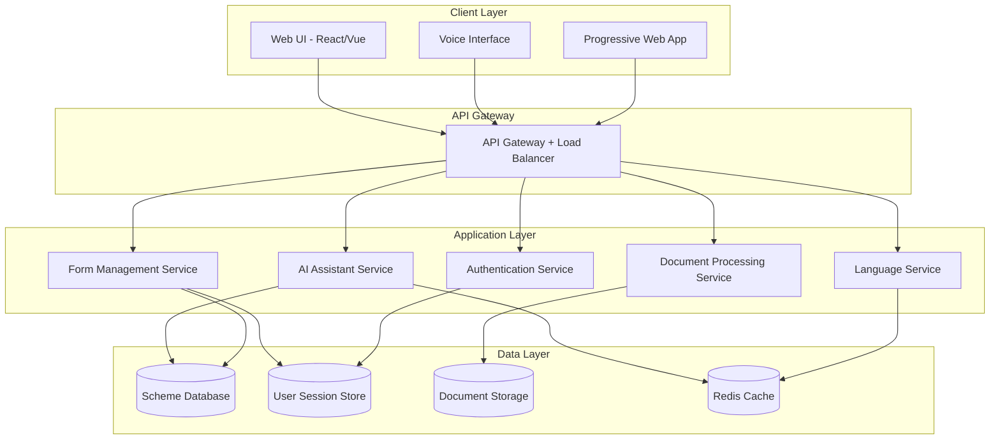
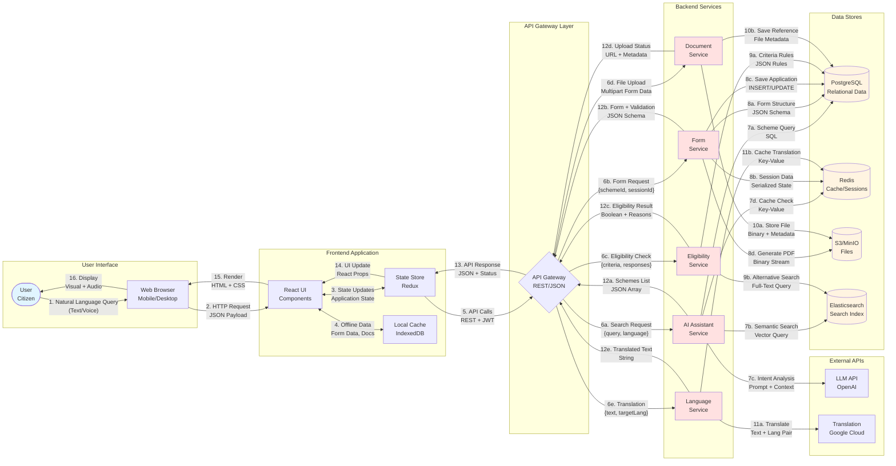
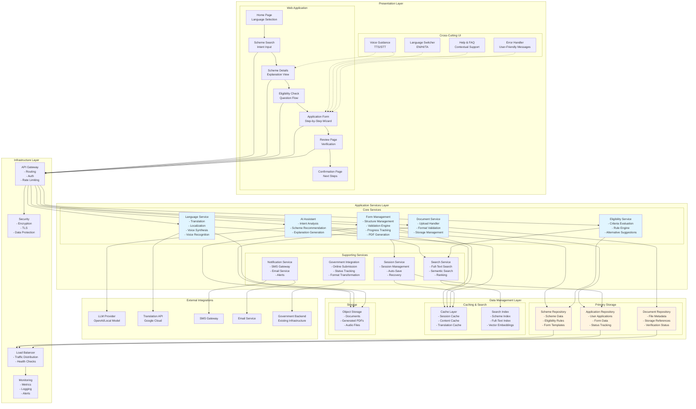
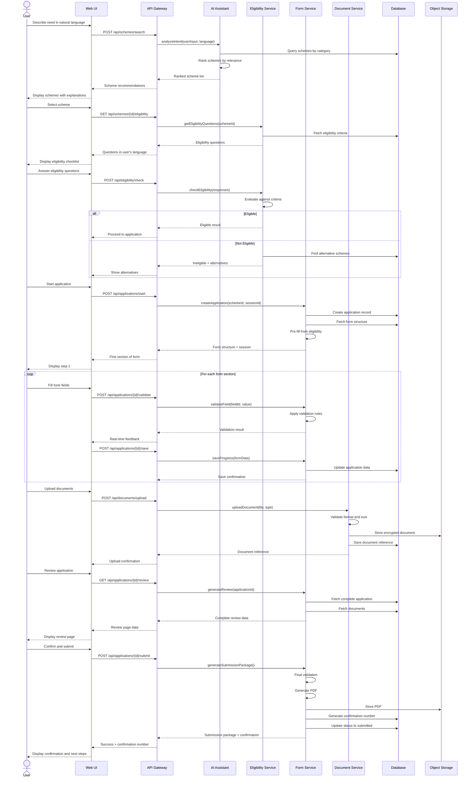
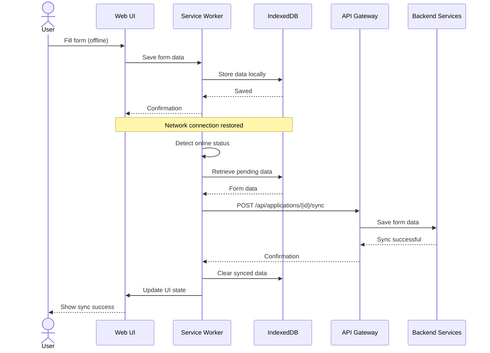

# Design Document: AI-Powered Government Application Assistant (AGAA)

## Overview

The AGAA system is a web-based application that assists Indian citizens in discovering, understanding, and completing government application forms. The MVP focuses on student scholarship applications for economic basis schemes in one state, with support for English, Hindi, and Tamil languages.

The system architecture follows a layered approach with clear separation between the presentation layer (responsive web UI), business logic layer (AI assistant, form validation, document processing), and data layer (scheme database, user sessions, document storage). The design prioritizes accessibility, mobile compatibility, and offline-capable progressive enhancement.

## Architecture

### High-Level Architecture



### System Overview with Data Flows



### Key Interfaces and Data Types

#### 1. User to Frontend Interface
**Protocol:** HTTP/HTTPS  
**Data Format:** HTML, CSS, JavaScript, JSON  
**Input Types:**
- Text input (form fields)
- Voice input (audio stream)
- File uploads (PDF, JPEG, PNG)
- Touch/click events

**Output Types:**
- Rendered HTML pages
- Audio output (TTS)
- Downloaded files (PDF, ZIP)

#### 2. Frontend to API Gateway Interface
**Protocol:** REST over HTTPS  
**Authentication:** JWT tokens  
**Content-Type:** application/json, multipart/form-data

**Key Endpoints:**

```
POST /api/schemes/search
Request: {
  query: string,
  language: "en" | "hi" | "ta",
  userProfile?: object
}
Response: {
  schemes: Scheme[],
  totalResults: number
}

GET /api/schemes/{schemeId}
Response: {
  id: string,
  name: Record<Language, string>,
  description: Record<Language, string>,
  eligibilityCriteria: Criterion[],
  requiredDocuments: string[],
  benefits: string[]
}

POST /api/eligibility/check
Request: {
  schemeId: string,
  responses: Record<string, any>
}
Response: {
  eligible: boolean,
  matchedCriteria: string[],
  failedCriteria: string[],
  alternatives?: Scheme[]
}

POST /api/applications/start
Request: {
  schemeId: string,
  sessionId: string,
  eligibilityData?: object
}
Response: {
  applicationId: string,
  formStructure: FormStructure,
  preFilled: Record<string, any>
}

POST /api/applications/{id}/validate
Request: {
  fieldId: string,
  value: any,
  context: object
}
Response: {
  valid: boolean,
  errors: ValidationError[]
}

POST /api/applications/{id}/save
Request: {
  sectionId: string,
  data: Record<string, any>
}
Response: {
  saved: boolean,
  completionPercentage: number
}

POST /api/documents/upload
Request: multipart/form-data {
  file: File,
  documentType: string,
  applicationId: string
}
Response: {
  documentId: string,
  url: string,
  verified: boolean
}

POST /api/applications/{id}/submit
Request: {
  submissionMode: "online" | "offline"
}
Response: {
  confirmationNumber: string,
  pdfUrl: string,
  printablePdfUrl?: string,  // For offline mode
  packageUrl: string,
  submissionMode: string,
  onlineSubmission?: {
    governmentConfirmationNumber: string,
    status: string,
    receiptUrl: string
  },
  offlineInstructions?: {
    officeAddress: string,
    officeHours: string,
    requiredCopies: number
  },
  nextSteps: string[],
  processingTime: string,
  contactInfo: object
}

POST /api/submissions/{id}/submit-online
Request: {
  applicationId: string
}
Response: {
  success: boolean,
  governmentConfirmationNumber?: string,
  governmentReceiptUrl?: string,
  errorMessage?: string,
  retryable: boolean
}

GET /api/submissions/{confirmationNumber}/status
Response: {
  status: "pending" | "received" | "processing" | "approved" | "rejected",
  lastUpdated: string,
  remarks?: string
}

POST /api/language/translate
Request: {
  text: string,
  targetLanguage: "en" | "hi" | "ta"
}
Response: {
  translatedText: string,
  sourceLanguage: string
}
```

#### 3. Backend Services to Database Interface
**Protocol:** PostgreSQL wire protocol  
**Connection:** Connection pooling (pg-pool)

**Key Data Models:**

```sql
-- Schemes Table
schemes {
  id: UUID PRIMARY KEY,
  category: VARCHAR(100),
  state: VARCHAR(50),
  active: BOOLEAN,
  created_at: TIMESTAMP
}

-- Scheme Translations
scheme_translations {
  scheme_id: UUID FK,
  language: VARCHAR(2),
  name: TEXT,
  description: TEXT,
  benefits: JSONB
}

-- Applications
applications {
  id: UUID PRIMARY KEY,
  session_id: UUID,
  scheme_id: UUID FK,
  form_data: JSONB,
  status: VARCHAR(50),
  confirmation_number: VARCHAR(50),
  created_at: TIMESTAMP,
  updated_at: TIMESTAMP
}

-- Documents
documents {
  id: UUID PRIMARY KEY,
  application_id: UUID FK,
  document_type: VARCHAR(100),
  storage_url: TEXT,
  file_size: INTEGER,
  verified: BOOLEAN
}
```

#### 4. Backend Services to Redis Interface
**Protocol:** Redis protocol (RESP)  
**Data Format:** Key-Value pairs, JSON strings

**Key Patterns:**

```
session:{sessionId} -> {
  id: string,
  language: string,
  createdAt: timestamp,
  expiresAt: timestamp,
  preferences: object
}
TTL: 30 days

form_progress:{applicationId} -> {
  schemeId: string,
  currentSection: number,
  data: object,
  lastModified: timestamp
}
TTL: 30 days

translation:{hash}:{language} -> string
TTL: 90 days

scheme_cache:{schemeId}:{language} -> Scheme object
TTL: 7 days
```

#### 5. Backend Services to Object Storage Interface
**Protocol:** S3 API (AWS SDK)  
**Operations:** PUT, GET, DELETE

**Storage Structure:**

```
/documents/{applicationId}/{documentType}/{documentId}.{ext}
- Content-Type: application/pdf, image/jpeg, image/png
- Encryption: AES-256
- Max Size: 5MB per file

/generated/{confirmationNumber}/application.pdf
- Content-Type: application/pdf
- Encryption: AES-256

/audio/{language}/{hash}.mp3
- Content-Type: audio/mpeg
- TTL: 90 days
```

#### 6. AI Service to LLM API Interface
**Protocol:** HTTPS REST  
**Authentication:** API Key

**Request Format:**

```json
{
  "model": "gpt-4",
  "messages": [
    {
      "role": "system",
      "content": "You are an assistant helping Indian citizens find government schemes..."
    },
    {
      "role": "user",
      "content": "I need scholarship for my daughter's college education"
    }
  ],
  "temperature": 0.7,
  "max_tokens": 500
}
```

**Response Format:**

```json
{
  "choices": [
    {
      "message": {
        "role": "assistant",
        "content": "Based on your need, I recommend the following schemes..."
      }
    }
  ],
  "usage": {
    "prompt_tokens": 150,
    "completion_tokens": 200
  }
}
```

#### 7. Language Service to Translation API Interface
**Protocol:** HTTPS REST  
**Authentication:** API Key

**Request Format:**

```json
{
  "q": "Please enter your annual income",
  "source": "en",
  "target": "hi",
  "format": "text"
}
```

**Response Format:**

```json
{
  "data": {
    "translations": [
      {
        "translatedText": "कृपया अपनी वार्षिक आय दर्ज करें",
        "detectedSourceLanguage": "en"
      }
    ]
  }
}
```

### Data Flow Examples

#### Example 1: Scheme Search Flow

```
User Input: "मुझे अपनी बेटी की शिक्षा के लिए छात्रवृत्ति चाहिए"
(I need scholarship for my daughter's education)

1. Browser → Frontend: Voice/Text input
2. Frontend → API Gateway: 
   POST /api/schemes/search
   {
     query: "मुझे अपनी बेटी की शिक्षा के लिए छात्रवृत्ति चाहिए",
     language: "hi"
   }

3. API Gateway → AI Service: Forward request

4. AI Service → LLM API:
   Analyze intent and extract keywords
   Response: {
     category: "scholarship",
     subcategory: "education",
     target: "daughter",
     keywords: ["छात्रवृत्ति", "शिक्षा", "बेटी"]
   }

5. AI Service → Elasticsearch:
   Search schemes matching:
   - category: "scholarship"
   - subcategory: "education"
   - gender: "female"

6. Elasticsearch → AI Service:
   Returns matching scheme IDs

7. AI Service → PostgreSQL:
   Fetch full scheme details for IDs

8. AI Service → Redis:
   Cache results

9. AI Service → API Gateway:
   {
     schemes: [
       {
         id: "scheme-123",
         name: { hi: "बालिका शिक्षा प्रोत्साहन योजना" },
         relevanceScore: 0.95,
         ...
       }
     ]
   }

10. API Gateway → Frontend: JSON response

11. Frontend → Browser: Render scheme cards

12. Browser → User: Display results
```

#### Example 2: Form Submission Flow

```
User Action: Submit completed application

1. Browser → Frontend: Click submit button

2. Frontend → API Gateway:
   POST /api/applications/{id}/submit
   Headers: { Authorization: "Bearer {jwt}" }

3. API Gateway → Form Service: Forward request

4. Form Service → Redis:
   GET form_progress:{applicationId}
   Returns: Complete form data

5. Form Service → Form Service:
   Validate all sections
   Result: All valid

6. Form Service → PostgreSQL:
   BEGIN TRANSACTION
   - UPDATE applications SET status='submitted'
   - INSERT INTO submission_log
   - Generate confirmation_number

7. Form Service → PDF Generator:
   Generate application PDF from form data
   Returns: PDF binary

8. Form Service → S3:
   PUT /generated/{confirmationNumber}/application.pdf
   Upload PDF with encryption

9. Form Service → PostgreSQL:
   COMMIT TRANSACTION

10. Form Service → Notification Service:
    Send confirmation SMS/Email

11. Form Service → API Gateway:
    {
      confirmationNumber: "AGAA-2024-001234",
      pdfUrl: "https://...",
      nextSteps: [...],
      processingTime: "15-20 days"
    }

12. API Gateway → Frontend: JSON response

13. Frontend → Browser: Render confirmation page

14. Browser → User: Display confirmation
```

### Building Blocks Architecture



### Component Responsibilities

**Presentation Layer:**
- **Web Application Pages**: User-facing interfaces for each stage of the application journey
- **Voice Module**: Handles text-to-speech and speech-to-text for accessibility
- **Language Switcher**: Manages language selection and switching
- **Help System**: Provides contextual help and FAQ
- **Error Display**: Shows user-friendly error messages

**Application Services Layer:**
- **AI Assistant**: Natural language understanding, scheme recommendation, and explanation generation
- **Form Management**: Handles form structure, validation, progress tracking, and PDF generation (both online and printable formats)
- **Eligibility Service**: Evaluates user eligibility against scheme criteria
- **Document Service**: Manages document uploads, validation, and storage
- **Language Service**: Provides translation, localization, and voice services
- **Session Service**: Manages user sessions, auto-save, and recovery
- **Notification Service**: Sends SMS and email notifications
- **Search Service**: Provides full-text and semantic search capabilities
- **Government Integration**: Handles online submission to existing government infrastructure, format transformation, and status tracking

**Data Management Layer:**
- **Scheme Repository**: Stores scheme data, eligibility rules, and form templates
- **Application Repository**: Stores user applications and form data
- **Document Repository**: Stores document metadata and references
- **Cache Layer**: Provides fast access to frequently used data
- **Search Index**: Enables efficient scheme discovery
- **Object Storage**: Stores files, PDFs, and audio

**External Integrations:**
- **LLM Provider**: AI model for natural language processing
- **Translation API**: Multi-language translation service
- **SMS/Email Providers**: Communication channels
- **Government Backend**: Existing government infrastructure for online application submission

**Infrastructure Layer:**
- **API Gateway**: Routes requests, handles authentication and rate limiting
- **Load Balancer**: Distributes traffic across service instances
- **Monitoring**: Tracks metrics, logs, and alerts
- **Security**: Manages encryption, TLS, and data protection

### Detailed Component Architecture

```mermaid
graph TB
    subgraph "Frontend - React Application"
        UI[User Interface Components]
        State[State Management - Redux]
        Router[React Router]
        SW[Service Worker - Offline Support]
        Voice[Voice Interface Module]
        I18n[i18next - Internationalization]
    end
    
    subgraph "API Layer"
        Gateway[API Gateway]
        Auth[JWT Authentication]
        RateLimit[Rate Limiter]
        Logger[Request Logger]
    end
    
    subgraph "Backend Services"
        subgraph "AI Assistant Service"
            NLP[NLP Engine]
            IntentClassifier[Intent Classifier]
            SchemeRanker[Scheme Ranker]
            Explainer[Explanation Generator]
        end
        
        subgraph "Form Management Service"
            FormEngine[Form Engine]
            Validator[Validation Engine]
            SessionMgr[Session Manager]
            PDFGen[PDF Generator]
        end
        
        subgraph "Document Service"
            Upload[Upload Handler]
            DocValidator[Document Validator]
            Storage[Storage Manager]
            OCR[OCR Engine - Optional]
        end
        
        subgraph "Language Service"
            Translator[Translation Engine]
            TTS[Text-to-Speech]
            STT[Speech-to-Text]
            LocaleManager[Locale Manager]
        end
        
        subgraph "Eligibility Service"
            EligChecker[Eligibility Checker]
            RuleEngine[Rule Engine]
            Recommender[Alternative Recommender]
        end
    end
    
    subgraph "Data Persistence"
        Postgres[(PostgreSQL<br/>Schemes, Sessions, Apps)]
        Redis[(Redis<br/>Cache, Sessions)]
        S3[(Object Storage<br/>Documents, PDFs)]
        ES[(Elasticsearch<br/>Scheme Search)]
    end
    
    subgraph "External Services"
        LLM[LLM API<br/>OpenAI/Local]
        TransAPI[Translation API<br/>Google Cloud]
        SMS[SMS Gateway]
        Email[Email Service]
    end
    
    UI --> Router
    UI --> State
    UI --> Voice
    UI --> I18n
    SW --> State
    
    Router --> Gateway
    State --> Gateway
    Voice --> Gateway
    
    Gateway --> Auth
    Gateway --> RateLimit
    Gateway --> Logger
    
    Gateway --> NLP
    Gateway --> FormEngine
    Gateway --> Upload
    Gateway --> Translator
    Gateway --> EligChecker
    
    NLP --> IntentClassifier
    NLP --> SchemeRanker
    NLP --> Explainer
    IntentClassifier --> LLM
    SchemeRanker --> ES
    Explainer --> LLM
    
    FormEngine --> Validator
    FormEngine --> SessionMgr
    FormEngine --> PDFGen
    Validator --> Redis
    SessionMgr --> Redis
    SessionMgr --> Postgres
    
    Upload --> DocValidator
    Upload --> Storage
    DocValidator --> OCR
    Storage --> S3
    
    Translator --> TransAPI
    Translator --> Redis
    TTS --> Voice
    STT --> Voice
    
    EligChecker --> RuleEngine
    EligChecker --> Recommender
    RuleEngine --> Postgres
    Recommender --> ES
    
    NLP --> Postgres
    FormEngine --> Postgres
    EligChecker --> Postgres
    
    PDFGen --> S3
    SessionMgr --> Email
    SessionMgr --> SMS
```



### Data Flow Diagrams

#### User Journey: Scheme Discovery to Application Submission



#### Offline Mode and Sync Flow



### Technology Stack

**Frontend:**
- Framework: React with TypeScript for type safety and component reusability
- UI Library: Material-UI or Chakra UI for accessible, mobile-responsive components
- State Management: Redux Toolkit or Zustand for application state
- PWA: Workbox for service worker management and offline capabilities
- Voice: Web Speech API for text-to-speech and speech-to-text
- Internationalization: i18next for multi-lingual support

**Backend:**
- Runtime: Node.js with Express or Python with FastAPI
- AI/NLP: OpenAI API or local LLM (Llama 2) for scheme recommendation
- Language Processing: Google Cloud Translation API or local models for Hindi/Tamil
- Document Processing: PDF.js for generation, Tesseract.js for OCR if needed
- Validation: Joi or Zod for schema validation

**Data Storage:**
- Primary Database: PostgreSQL for scheme data and user sessions
- Document Storage: AWS S3 or local MinIO for uploaded documents
- Cache: Redis for session management and frequently accessed data
- Search: Elasticsearch for scheme discovery and full-text search

**Infrastructure:**
- Hosting: Cloud provider (AWS/Azure/GCP) or on-premise for government compliance
- CDN: CloudFront or similar for static asset delivery
- Security: TLS 1.3, encryption at rest, JWT for authentication

### Design Principles

1. **Mobile-First**: Design for mobile screens first, then scale up
2. **Progressive Enhancement**: Core functionality works without JavaScript, enhanced with it
3. **Offline-Capable**: Forms can be filled offline and synced when online
4. **Accessibility-First**: WCAG 2.1 AA compliance from the start
5. **Privacy by Design**: Minimal data collection, encryption by default
6. **Localization-Native**: Multi-lingual support built into every component

## Components and Interfaces

### 1. AI Assistant Service

**Responsibility:** Understands user intent, recommends schemes, provides explanations

**Key Functions:**
- `analyzeUserIntent(userInput: string, language: string): Intent`
- `recommendSchemes(intent: Intent, userProfile: UserProfile): Scheme[]`
- `explainScheme(schemeId: string, language: string, simplificationLevel: string): Explanation`
- `answerQuestion(question: string, context: ApplicationContext): Answer`

**Interface:**
```typescript
interface Intent {
  category: string;           // "scholarship", "farmer_benefit", etc.
  subcategory: string;        // "economic_basis", "merit_based", etc.
  keywords: string[];
  confidence: number;
}

interface Scheme {
  id: string;
  name: Record<Language, string>;
  description: Record<Language, string>;
  category: string;
  eligibilityCriteria: EligibilityCriterion[];
  requiredDocuments: Document[];
  benefits: string[];
  processingTime: string;
  relevanceScore: number;
}

interface Explanation {
  summary: string;
  benefits: string[];
  eligibility: string[];
  process: Step[];
  requiredDocuments: string[];
  audioUrl?: string;          // For voice guidance
}
```

**Implementation Approach:**
- Use a fine-tuned LLM or prompt-engineered GPT model for intent classification
- Maintain a vector database of scheme embeddings for semantic search
- Implement a ranking algorithm based on user profile and scheme relevance
- Generate simplified explanations using controlled language generation
- Cache common queries and explanations in Redis

### 2. Form Management Service

**Responsibility:** Manages form structure, validation rules, user progress

**Key Functions:**
- `getFormStructure(schemeId: string, language: string): FormStructure`
- `validateField(fieldId: string, value: any, context: FormContext): ValidationResult`
- `validateSection(sectionId: string, data: Record<string, any>): ValidationResult`
- `saveProgress(sessionId: string, formData: Partial<FormData>): void`
- `loadProgress(sessionId: string): FormData`
- `generateSubmissionPackage(formData: FormData, documents: Document[], mode: "online" | "offline"): SubmissionPackage`
- `generatePrintablePDF(formData: FormData, documents: Document[]): PDF`

**Interface:**
```typescript
interface FormStructure {
  schemeId: string;
  sections: FormSection[];
  totalSteps: number;
}

interface FormSection {
  id: string;
  title: Record<Language, string>;
  description: Record<Language, string>;
  fields: FormField[];
  order: number;
}

interface FormField {
  id: string;
  type: FieldType;          // "text", "number", "date", "select", "file", etc.
  label: Record<Language, string>;
  helpText: Record<Language, string>;
  placeholder: Record<Language, string>;
  required: boolean;
  validationRules: ValidationRule[];
  dependencies?: FieldDependency[];
  voiceGuidance?: Record<Language, string>;
}

interface ValidationRule {
  type: string;             // "required", "minLength", "maxLength", "pattern", "custom"
  value?: any;
  errorMessage: Record<Language, string>;
  validator?: (value: any, context: FormContext) => boolean;
}

interface ValidationResult {
  valid: boolean;
  errors: ValidationError[];
  warnings?: ValidationWarning[];
}

interface FormData {
  schemeId: string;
  sessionId: string;
  currentSection: number;
  data: Record<string, any>;
  documents: DocumentReference[];
  lastModified: Date;
  completionPercentage: number;
}
```

**Implementation Approach:**
- Store form structures as JSON schemas in the database
- Implement a rule engine for complex validation logic
- Use Redis for session storage with TTL of 30 days
- Implement auto-save every 30 seconds or on field blur
- Support conditional field display based on previous answers

### 3. Document Processing Service

**Responsibility:** Handles document upload, verification, storage, and PDF generation

**Key Functions:**
- `uploadDocument(file: File, documentType: string, sessionId: string): DocumentReference`
- `verifyDocument(documentId: string): VerificationResult`
- `generateApplicationPDF(formData: FormData, template: string): PDF`
- `generateSubmissionPackage(applicationPDF: PDF, documents: Document[]): Package`

**Interface:**
```typescript
interface DocumentReference {
  id: string;
  type: string;             // "income_certificate", "caste_certificate", etc.
  fileName: string;
  fileSize: number;
  mimeType: string;
  uploadedAt: Date;
  verified: boolean;
  storageUrl: string;
}

interface VerificationResult {
  valid: boolean;
  readable: boolean;
  issues: string[];
  suggestions: string[];
}

interface SubmissionPackage {
  confirmationNumber: string;
  applicationPDF: string;   // URL or base64
  printablePDF?: string;    // Optimized for printing with offline submission instructions
  documents: DocumentReference[];
  submissionMode: "online" | "offline";
  onlineSubmissionData?: {
    governmentConfirmationNumber?: string;
    submissionStatus: string;
    submissionTimestamp: Date;
  };
  offlineSubmissionInstructions?: {
    officeAddress: string;
    officeHours: string;
    requiredCopies: number;
    additionalNotes: string[];
  };
  generatedAt: Date;
  expiresAt: Date;
}
```

**Implementation Approach:**
- Accept PDF, JPEG, PNG formats up to 5MB per file
- Perform basic checks: file size, format, corruption
- Use image processing to check for blur/quality issues
- Store documents in encrypted object storage (S3/MinIO)
- Generate PDFs using a template engine (Puppeteer or PDFKit)
- Include QR code with confirmation number on generated PDF

### 4. Language Service

**Responsibility:** Handles translation, localization, and voice synthesis

**Key Functions:**
- `translate(text: string, fromLang: Language, toLang: Language): string`
- `getLocalizedContent(contentId: string, language: Language): string`
- `synthesizeSpeech(text: string, language: Language): AudioBuffer`
- `recognizeSpeech(audio: AudioBuffer, language: Language): string`

**Interface:**
```typescript
type Language = "en" | "hi" | "ta";

interface LocalizedContent {
  contentId: string;
  translations: Record<Language, string>;
  audioUrls?: Record<Language, string>;
}

interface VoiceConfig {
  language: Language;
  voice: string;            // Voice ID for TTS
  rate: number;             // Speech rate
  pitch: number;            // Speech pitch
}
```

**Implementation Approach:**
- Pre-translate all static content (UI labels, help text, instructions)
- Store translations in database with fallback to English
- Use Google Cloud Translation API for dynamic content
- Implement Web Speech API on frontend for voice features
- Cache synthesized audio for common phrases
- Support Devanagari script for Hindi and Tamil script rendering

### 5. Eligibility Checker

**Responsibility:** Evaluates user eligibility for schemes

**Key Functions:**
- `checkEligibility(schemeId: string, userResponses: EligibilityResponses): EligibilityResult`
- `getEligibilityQuestions(schemeId: string, language: Language): Question[]`
- `suggestAlternatives(schemeId: string, failedCriteria: string[]): Scheme[]`

**Interface:**
```typescript
interface EligibilityCriterion {
  id: string;
  question: Record<Language, string>;
  type: "boolean" | "number" | "select" | "date";
  condition: string;        // Expression like "age >= 18 && age <= 25"
  required: boolean;
}

interface EligibilityResult {
  eligible: boolean;
  matchedCriteria: string[];
  failedCriteria: string[];
  alternativeSchemes: Scheme[];
  explanation: Record<Language, string>;
}
```

**Implementation Approach:**
- Define eligibility criteria as declarative rules in JSON
- Implement an expression evaluator for complex conditions
- Support AND/OR logic for multiple criteria
- Pre-fill form fields from eligibility responses
- Suggest similar schemes when user is ineligible

### 6. Session Manager

**Responsibility:** Manages user sessions, authentication, and progress tracking

**Key Functions:**
- `createSession(deviceInfo: DeviceInfo): Session`
- `getSession(sessionId: string): Session`
- `updateSession(sessionId: string, updates: Partial<Session>): void`
- `expireSession(sessionId: string): void`

**Interface:**
```typescript
interface Session {
  id: string;
  createdAt: Date;
  lastAccessedAt: Date;
  expiresAt: Date;
  language: Language;
  deviceInfo: DeviceInfo;
  currentApplication?: {
    schemeId: string;
    formData: FormData;
    step: number;
  };
  preferences: UserPreferences;
}

interface UserPreferences {
  voiceGuidanceEnabled: boolean;
  fontSize: "small" | "medium" | "large";
  highContrast: boolean;
  autoSave: boolean;
}
```

**Implementation Approach:**
- Use Redis for session storage with 30-day TTL
- Generate cryptographically secure session IDs
- Store minimal PII in sessions
- Implement session refresh on activity
- Support session recovery via email/SMS link

### 7. Government Integration Service

**Responsibility:** Handles integration with existing government backend systems for online submission

**Key Functions:**
- `submitApplication(applicationData: ApplicationData, documents: Document[]): SubmissionResult`
- `formatForGovernmentSystem(applicationData: ApplicationData): GovernmentFormat`
- `authenticateWithGovernment(credentials: Credentials): AuthToken`
- `checkSubmissionStatus(confirmationNumber: string): SubmissionStatus`
- `retryFailedSubmission(submissionId: string): SubmissionResult`

**Interface:**
```typescript
interface GovernmentFormat {
  schemeCode: string;
  applicantDetails: Record<string, any>;
  documents: DocumentReference[];
  metadata: {
    submissionSource: "AGAA";
    timestamp: Date;
    version: string;
  };
}

interface SubmissionResult {
  success: boolean;
  governmentConfirmationNumber?: string;
  governmentReceiptUrl?: string;
  errorCode?: string;
  errorMessage?: string;
  retryable: boolean;
}

interface SubmissionStatus {
  status: "pending" | "received" | "processing" | "approved" | "rejected";
  lastUpdated: Date;
  remarks?: string;
}
```

**Implementation Approach:**
- Implement adapter pattern for different government system APIs
- Use circuit breaker pattern for resilience
- Implement retry logic with exponential backoff
- Log all integration attempts for audit trail
- Support both REST and SOAP protocols as needed
- Handle authentication tokens and refresh
- Transform AGAA data format to government system format
- Validate responses from government system
- Store submission attempts and responses for tracking

## Data Models

### Scheme Database Schema

```sql
-- Schemes table
CREATE TABLE schemes (
  id UUID PRIMARY KEY,
  category VARCHAR(100) NOT NULL,
  subcategory VARCHAR(100),
  state VARCHAR(50) NOT NULL,
  active BOOLEAN DEFAULT true,
  created_at TIMESTAMP DEFAULT NOW(),
  updated_at TIMESTAMP DEFAULT NOW()
);

-- Scheme translations
CREATE TABLE scheme_translations (
  scheme_id UUID REFERENCES schemes(id),
  language VARCHAR(2) NOT NULL,
  name TEXT NOT NULL,
  description TEXT NOT NULL,
  benefits JSONB,
  PRIMARY KEY (scheme_id, language)
);

-- Eligibility criteria
CREATE TABLE eligibility_criteria (
  id UUID PRIMARY KEY,
  scheme_id UUID REFERENCES schemes(id),
  criterion_type VARCHAR(50) NOT NULL,
  condition TEXT NOT NULL,
  required BOOLEAN DEFAULT true,
  order_index INTEGER
);

-- Form structures
CREATE TABLE form_structures (
  id UUID PRIMARY KEY,
  scheme_id UUID REFERENCES schemes(id),
  structure JSONB NOT NULL,
  version INTEGER DEFAULT 1,
  active BOOLEAN DEFAULT true
);

-- User sessions
CREATE TABLE user_sessions (
  id UUID PRIMARY KEY,
  session_data JSONB NOT NULL,
  created_at TIMESTAMP DEFAULT NOW(),
  last_accessed_at TIMESTAMP DEFAULT NOW(),
  expires_at TIMESTAMP NOT NULL
);

-- Applications (saved progress)
CREATE TABLE applications (
  id UUID PRIMARY KEY,
  session_id UUID REFERENCES user_sessions(id),
  scheme_id UUID REFERENCES schemes(id),
  form_data JSONB NOT NULL,
  documents JSONB,
  status VARCHAR(50) DEFAULT 'in_progress',
  submission_mode VARCHAR(20),  -- 'online', 'offline', or NULL
  confirmation_number VARCHAR(50) UNIQUE,
  government_confirmation_number VARCHAR(100),  -- From government system
  submission_attempts JSONB,  -- Track online submission attempts
  created_at TIMESTAMP DEFAULT NOW(),
  updated_at TIMESTAMP DEFAULT NOW(),
  submitted_at TIMESTAMP
);

-- Documents
CREATE TABLE documents (
  id UUID PRIMARY KEY,
  application_id UUID REFERENCES applications(id),
  document_type VARCHAR(100) NOT NULL,
  file_name VARCHAR(255) NOT NULL,
  storage_url TEXT NOT NULL,
  file_size INTEGER,
  mime_type VARCHAR(100),
  verified BOOLEAN DEFAULT false,
  uploaded_at TIMESTAMP DEFAULT NOW()
);
```

### Document Storage Structure

```
/documents/
  /{session_id}/
    /{document_type}/
      /{document_id}.{ext}
      
/generated/
  /{confirmation_number}/
    /application.pdf
    /package.zip
```

### Cache Structure (Redis)

```
session:{session_id} -> Session JSON (TTL: 30 days)
form_progress:{session_id} -> FormData JSON (TTL: 30 days)
scheme:{scheme_id}:{language} -> Scheme JSON (TTL: 7 days)
translation:{content_id}:{language} -> string (TTL: 30 days)
audio:{text_hash}:{language} -> Audio URL (TTL: 90 days)
```

## Correctness Properties

*A property is a characteristic or behavior that should hold true across all valid executions of a system - essentially, a formal statement about what the system should do. Properties serve as the bridge between human-readable specifications and machine-verifiable correctness guarantees.*


### Property Reflection

After analyzing all acceptance criteria, I've identified the following consolidations to eliminate redundancy:

**Consolidations:**
1. Properties 1.3, 2.2, 6.1 all test that required information fields are present in responses - can be combined into one comprehensive property about response completeness
2. Properties 4.2 and 14.4 both test that descriptive text is present (help text and alt text) - can be combined into a property about required metadata
3. Properties 5.1, 5.2, 5.3 all test validation behavior - can be combined into one comprehensive validation property
4. Properties 6.2, 6.3, 6.4 all test document validation - can be combined into one comprehensive document validation property
5. Properties 9.2 and 8.4 both test that documents are included in packages - redundant, keep only 9.2
6. Properties 10.1, 10.2, 10.3, 10.4 all test that post-submission information is present - can be combined into one property
7. Properties 13.1 and 13.5 both test save functionality - can be combined
8. Properties 14.1 and 14.5 both test voice guidance availability - can be combined

**Unique Properties to Keep:**
- Scheme ranking (1.2)
- Multi-language support (1.4, 7.2)
- Eligibility evaluation logic (3.2)
- Eligibility round-trip (3.5)
- Form structure (4.1)
- Real-time validation (4.3)
- Language switching invariant (7.4)
- Review structure matching (8.2)
- Confirmation number uniqueness (9.3)
- Session restoration round-trip (13.2)
- Session retention (13.3)
- Data preservation during errors (15.2)

### Correctness Properties

Property 1: Scheme Recommendation Completeness
*For any* scheme recommendation response, the response SHALL include scheme name, description, benefits, eligibility criteria, and required documents in the requested language
**Validates: Requirements 1.3, 2.2, 6.1**

Property 2: Scheme Ranking Order
*For any* set of recommended schemes, the schemes SHALL be ordered by relevance score in descending order
**Validates: Requirements 1.2**

Property 3: Multi-Language Query Support
*For any* valid user query in English, Hindi, or Tamil, the AI_Assistant SHALL return relevant scheme recommendations
**Validates: Requirements 1.4**

Property 4: Language-Specific Content Delivery
*For any* content request with a specified language, all returned text content SHALL be in the requested language
**Validates: Requirements 1.5, 7.2**

Property 5: Eligibility Evaluation Correctness
*For any* set of user responses and eligibility criteria, the eligibility result SHALL correctly reflect whether all required criteria are met according to the defined rules
**Validates: Requirements 3.2, 3.4**

Property 6: Eligibility to Form Pre-fill Round Trip
*For any* eligibility responses that are stored, retrieving the form structure SHALL pre-fill fields with the corresponding eligibility values
**Validates: Requirements 3.5**

Property 7: Ineligibility Alternative Suggestions
*For any* eligibility check that fails, the response SHALL include an explanation of failed criteria and suggest alternative schemes if available
**Validates: Requirements 3.3**

Property 8: Form Structure Sectioning
*For any* form structure, the form SHALL be organized into multiple sections with each section containing a subset of fields
**Validates: Requirements 4.1**

Property 9: Form Field Metadata Completeness
*For any* form field, the field SHALL include label, help text, type, and validation rules
**Validates: Requirements 4.2, 14.4**

Property 10: Real-Time Validation Feedback
*For any* field with validation rules, entering invalid data SHALL immediately return validation errors with descriptive messages
**Validates: Requirements 4.3, 5.1, 5.2, 5.3**

Property 11: Voice Guidance Availability
*For any* content element (field label, help text, instruction) when voice guidance is enabled, audio content SHALL be available in the user's selected language
**Validates: Requirements 2.5, 4.4, 14.1, 14.5**

Property 12: Document Validation
*For any* uploaded document, the system SHALL validate file format (PDF, JPEG, PNG), file size (≤5MB), and readability, returning errors for invalid documents
**Validates: Requirements 6.2, 6.3, 6.4**

Property 13: Document Completeness Check
*For any* scheme with required documents, when all required document types are uploaded, the system SHALL confirm the document package is complete
**Validates: Requirements 6.5**

Property 14: Language Switching Data Invariant
*For any* form session, switching the display language SHALL preserve all entered form data unchanged
**Validates: Requirements 7.4**

Property 15: Review Structure Consistency
*For any* completed form, the review page structure SHALL match the original form structure with sections in the same order
**Validates: Requirements 8.1, 8.2**

Property 16: Review Document Inclusion
*For any* completed form with uploaded documents, the review page SHALL include all uploaded documents
**Validates: Requirements 8.4**

Property 17: Submission Package Completeness
*For any* confirmed application, the generated submission package SHALL include the application PDF and all uploaded documents
**Validates: Requirements 9.1, 9.2**

Property 18: Confirmation Number Uniqueness
*For any* two distinct applications, the generated confirmation numbers SHALL be different
**Validates: Requirements 9.3**

Property 19: Submission Package Download Availability
*For any* generated submission package, download URLs SHALL be provided for the PDF and complete package
**Validates: Requirements 9.4**

Property 20: Post-Submission Guidance Completeness
*For any* generated submission package, the response SHALL include next steps, processing timeline, contact information, and tracking instructions
**Validates: Requirements 10.1, 10.2, 10.3, 10.4**

Property 21: Notification Availability with Contact Info
*For any* submission with user contact information (email or phone), notification options SHALL be offered
**Validates: Requirements 10.5**

Property 22: Offline Data Sync
*For any* form data saved locally during offline mode, when connection is restored, the data SHALL sync to the server
**Validates: Requirements 11.5**

Property 23: Session Expiration Timeline
*For any* saved application session, the session SHALL remain accessible for at least 30 days from last access
**Validates: Requirements 12.3, 13.3**

Property 24: Auto-Save Functionality
*For any* form data entry, the system SHALL automatically save progress within a reasonable interval (≤60 seconds)
**Validates: Requirements 13.1, 13.5**

Property 25: Session Restoration Round Trip
*For any* saved form session, retrieving the session SHALL restore all previously entered data and uploaded document references
**Validates: Requirements 13.2**

Property 26: Expiration Notification with Contact
*For any* application session approaching expiration with available contact information, a notification SHALL be sent before deletion
**Validates: Requirements 13.4**

Property 27: Voice Input Processing
*For any* voice input in a supported language, the system SHALL convert the audio to text and populate the corresponding form field
**Validates: Requirements 14.2**

Property 28: Error Message Localization
*For any* system error, the error message SHALL be displayed in the user's currently selected language
**Validates: Requirements 15.1**

Property 29: Error Data Preservation
*For any* critical error during form submission, all user-entered data SHALL remain retrievable after the error
**Validates: Requirements 15.2**

Property 30: Support Information Availability
*For any* system response, technical support contact information SHALL be accessible
**Validates: Requirements 15.4**

Property 31: Contextual Help Relevance
*For any* help request from a specific form field or error state, the returned guidance SHALL be specific to that context
**Validates: Requirements 15.5**

Property 32: Online Submission Data Formatting
*For any* application submitted online, the data SHALL be formatted according to the government system's specifications before transmission
**Validates: Requirements 10.3**

Property 33: Online Submission Success Acknowledgment
*For any* successful online submission, the system SHALL receive and store the government system's confirmation number
**Validates: Requirements 10.5**

Property 34: Submission Mode Selection
*For any* completed application, the user SHALL be able to choose between online and offline submission modes
**Validates: Requirements 9.7, 10.1, 11.2, 11.3**

Property 35: Printable PDF Generation
*For any* application package, a print-optimized PDF SHALL be generated that includes offline submission instructions
**Validates: Requirements 9.6**

Property 36: Submission Retry Capability
*For any* failed online submission, the system SHALL preserve all data and allow retry or fallback to offline mode
**Validates: Requirements 10.6**

## Error Handling

### Error Categories

**1. User Input Errors**
- Invalid field values (format, range, pattern violations)
- Missing required fields
- Inconsistent data across fields
- Invalid document formats or sizes

**Response Strategy:**
- Return 400 Bad Request with detailed validation errors
- Include field-specific error messages in user's language
- Preserve all valid data entered
- Suggest corrections where possible

**2. System Errors**
- Database connection failures
- External API failures (translation, AI services)
- File storage errors
- Session expiration

**Response Strategy:**
- Return 500 Internal Server Error for unexpected failures
- Return 503 Service Unavailable for temporary outages
- Log detailed error information for debugging
- Display user-friendly messages without technical details
- Preserve user data in local storage
- Provide retry mechanisms

**3. Authentication/Authorization Errors**
- Invalid or expired session
- Unauthorized access attempts

**Response Strategy:**
- Return 401 Unauthorized for invalid sessions
- Redirect to session creation
- Preserve form data for session recovery

**4. Resource Not Found Errors**
- Invalid scheme ID
- Missing form structure
- Document not found

**Response Strategy:**
- Return 404 Not Found
- Suggest valid alternatives
- Provide navigation back to valid state

### Error Response Format

```typescript
interface ErrorResponse {
  error: {
    code: string;              // Machine-readable error code
    message: string;           // User-friendly message in user's language
    details?: ValidationError[];
    recoveryOptions?: RecoveryOption[];
    supportContact?: ContactInfo;
  };
  timestamp: string;
  requestId: string;           // For support tracking
}

interface ValidationError {
  field: string;
  code: string;
  message: string;
  suggestion?: string;
}

interface RecoveryOption {
  action: string;              // "retry", "restore", "contact_support"
  label: string;
  endpoint?: string;
}
```

### Retry and Circuit Breaker

- Implement exponential backoff for transient failures
- Circuit breaker for external services (AI, translation)
- Fallback to cached data when services unavailable
- Queue operations for offline mode

### Data Integrity

- Validate all inputs at API boundary
- Use database transactions for multi-step operations
- Implement idempotency keys for submission operations
- Regular backups of session and application data

## Testing Strategy

### Dual Testing Approach

The AGAA system requires both unit testing and property-based testing for comprehensive coverage:

**Unit Tests** focus on:
- Specific examples of scheme recommendations
- Edge cases (empty inputs, boundary values, special characters)
- Error conditions (network failures, invalid documents)
- Integration points between services
- Language-specific rendering and translation accuracy

**Property-Based Tests** focus on:
- Universal properties that hold across all inputs
- Validation logic correctness across random data
- Data preservation through transformations
- API contract compliance across all endpoints

Together, these approaches ensure both concrete bug detection and general correctness verification.

### Property-Based Testing Configuration

**Framework Selection:**
- JavaScript/TypeScript: fast-check
- Python: Hypothesis

**Test Configuration:**
- Minimum 100 iterations per property test
- Each test tagged with: **Feature: agaa-system, Property {N}: {property_text}**
- Generators for: schemes, form data, documents, user inputs, sessions
- Shrinking enabled to find minimal failing cases

**Example Test Structure:**
```typescript
// Feature: agaa-system, Property 2: Scheme Ranking Order
test('schemes are ranked by relevance score', () => {
  fc.assert(
    fc.property(
      fc.array(schemeGenerator(), { minLength: 2 }),
      (schemes) => {
        const ranked = rankSchemes(schemes);
        return isDescendingByRelevance(ranked);
      }
    ),
    { numRuns: 100 }
  );
});
```

### Unit Testing Strategy

**Coverage Areas:**
1. **AI Assistant Service**
   - Test intent classification with sample queries
   - Test scheme ranking algorithm with known datasets
   - Test explanation generation for each language
   - Test edge cases: empty queries, very long queries, special characters

2. **Form Management Service**
   - Test form structure retrieval for each scheme
   - Test validation rules for each field type
   - Test session save/restore with various data states
   - Test PDF generation with sample data

3. **Document Processing Service**
   - Test upload with valid/invalid formats
   - Test file size limits
   - Test document verification logic
   - Test package generation

4. **Language Service**
   - Test translation for each language pair
   - Test voice synthesis for each language
   - Test content localization
   - Test script rendering (Devanagari, Tamil)

5. **Eligibility Checker**
   - Test evaluation logic for each criterion type
   - Test complex AND/OR conditions
   - Test alternative scheme suggestions
   - Test pre-fill mapping

6. **Integration Tests**
   - Test complete application flow from discovery to submission
   - Test language switching during application
   - Test offline mode and sync
   - Test error recovery scenarios

### Test Data Management

**Scheme Database:**
- Maintain test schemes for each category
- Include schemes with various eligibility criteria
- Cover all document types
- Include translations for all languages

**Form Templates:**
- Test forms with different field types
- Forms with conditional fields
- Forms with complex validation rules
- Multi-section forms

**Document Samples:**
- Valid documents in each format (PDF, JPEG, PNG)
- Invalid documents (corrupted, wrong format, too large)
- Documents with various quality levels

### Performance Testing

**Load Testing:**
- Concurrent users: 1000+ simultaneous sessions
- Form submission rate: 100+ per minute
- Document upload throughput: 50MB/s aggregate

**Response Time Targets:**
- Scheme search: <500ms
- Form field validation: <100ms
- Document upload: <2s for 5MB file
- PDF generation: <3s
- Page load: <2s on 3G connection

### Security Testing

- Penetration testing for injection attacks
- Authentication bypass attempts
- Session hijacking tests
- Data encryption verification
- GDPR compliance audit

### Accessibility Testing

- Screen reader compatibility (NVDA, JAWS)
- Keyboard navigation testing
- Color contrast verification
- Voice guidance accuracy
- Mobile accessibility testing

### Localization Testing

- Translation accuracy review by native speakers
- Cultural appropriateness review
- Script rendering verification
- Voice quality assessment for each language
- RTL layout testing if needed

### Monitoring and Observability

**Metrics to Track:**
- Application completion rate
- Average time to complete application
- Validation error frequency by field
- Document rejection rate
- Session abandonment points
- API response times
- Error rates by type
- Language usage distribution

**Logging:**
- Structured logging with correlation IDs
- User journey tracking (anonymized)
- Error stack traces
- Performance metrics
- Security events

**Alerting:**
- High error rates
- Slow response times
- Service unavailability
- Unusual traffic patterns
- Security incidents
