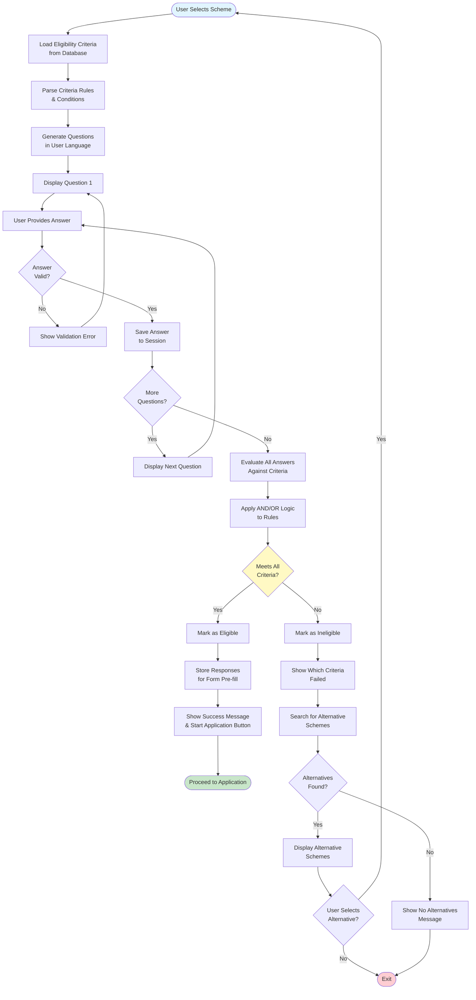
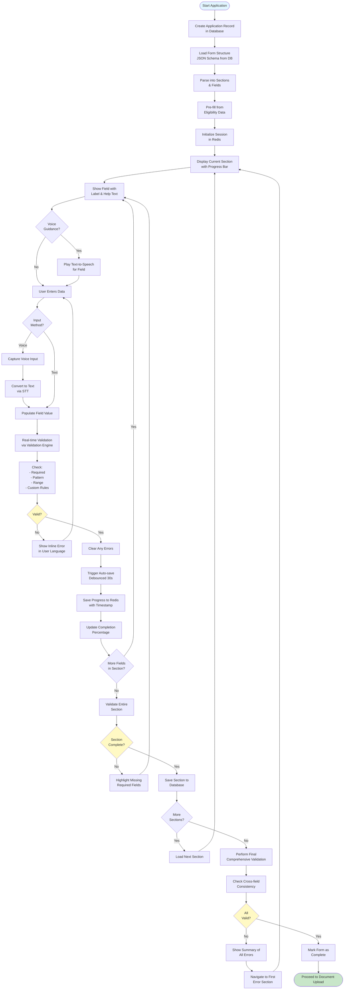
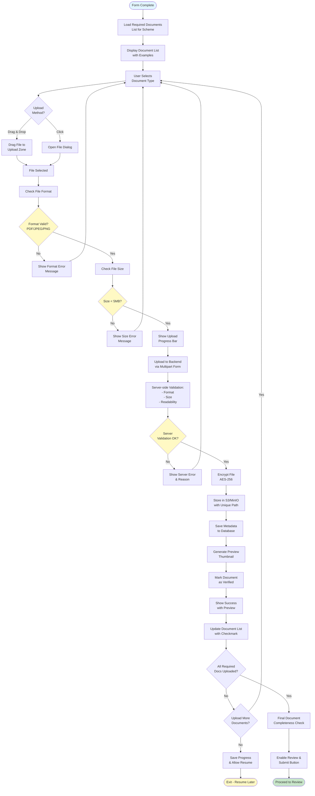
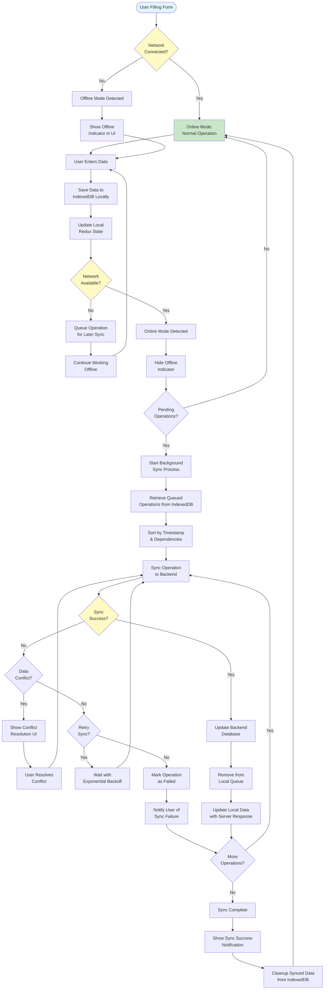

# AGAA System - Process Flow Diagrams

This document contains comprehensive process flow diagrams for the AI-Powered Government Application Assistant (AGAA) system.

## Table of Contents
1. [Complete User Journey Flow](#complete-user-journey-flow)
2. [Scheme Discovery Process](#scheme-discovery-process)
3. [Eligibility Check Process](#eligibility-check-process)
4. [Form Filling Process](#form-filling-process)
5. [Document Upload Process](#document-upload-process)
6. [Submission Process (Online & Offline)](#submission-process)
7. [Offline Mode & Sync Process](#offline-mode--sync-process)

---

## Complete User Journey Flow

```mermaid
flowchart TD
    Start([User Opens AGAA System]) --> LangSelect{Language<br/>Selected?}
    
    LangSelect -->|No| SelectLang[Select Language:<br/>English/Hindi/Tamil]
    SelectLang --> HomePage
    LangSelect -->|Yes| HomePage[Home Page]
    
    HomePage --> SearchInput[Enter Need in<br/>Natural Language]
    SearchInput --> AIAnalysis[AI Analyzes Intent<br/>& Extracts Keywords]
    
    AIAnalysis --> SearchDB[(Search Schemes<br/>in Database)]
    SearchDB --> RankSchemes[Rank Schemes<br/>by Relevance]
    
    RankSchemes --> DisplayResults[Display Scheme<br/>Recommendations]
    DisplayResults --> UserSelectScheme{User Selects<br/>Scheme?}
    
    UserSelectScheme -->|No| SearchInput
    UserSelectScheme -->|Yes| SchemeDetails[Show Scheme Details:<br/>Benefits, Documents,<br/>Process]
    
    SchemeDetails --> StartElig{Start Eligibility<br/>Check?}
    StartElig -->|No| DisplayResults
    StartElig -->|Yes| EligQuestions[Display Eligibility<br/>Questions]
    
    EligQuestions --> UserAnswers[User Answers<br/>Questions]
    UserAnswers --> EvalElig[Evaluate Against<br/>Eligibility Criteria]
    
    EvalElig --> CheckResult{Eligible?}
    CheckResult -->|No| ShowAlternatives[Show Alternative<br/>Schemes]
    ShowAlternatives --> TryAgain{Try Another<br/>Scheme?}
    TryAgain -->|Yes| DisplayResults
    TryAgain -->|No| End([Exit])
    
    CheckResult -->|Yes| ConfirmElig[Confirm Eligibility<br/>& Pre-fill Data]
    ConfirmElig --> StartApp{Start<br/>Application?}
    
    StartApp -->|No| End
    StartApp -->|Yes| CreateSession[Create Application<br/>Session]
    
    CreateSession --> LoadForm[Load Form Structure<br/>from Database]
    LoadForm --> Section1[Display Section 1<br/>of Form]
    
    Section1 --> FillFields[User Fills Fields<br/>with Help Text]
    FillFields --> ValidateField[Real-time Field<br/>Validation]
    
    ValidateField --> FieldValid{Field<br/>Valid?}
    FieldValid -->|No| ShowError[Show Error<br/>Message]
    ShowError --> FillFields
    
    FieldValid -->|Yes| AutoSave[Auto-save Progress<br/>to Redis]
    AutoSave --> MoreFields{More Fields<br/>in Section?}
    
    MoreFields -->|Yes| FillFields
    MoreFields -->|No| SectionComplete[Section Complete]
    
    SectionComplete --> MoreSections{More<br/>Sections?}
    MoreSections -->|Yes| NextSection[Load Next Section]
    NextSection --> FillFields
    
    MoreSections -->|No| UploadDocs[Upload Required<br/>Documents]
    UploadDocs --> ValidateDocs[Validate Document<br/>Format & Size]
    
    ValidateDocs --> DocsValid{Documents<br/>Valid?}
    DocsValid -->|No| ShowDocError[Show Document<br/>Error]
    ShowDocError --> UploadDocs
    
    DocsValid -->|Yes| StoreDocs[Store Documents<br/>in S3/MinIO]
    StoreDocs --> AllDocsUploaded{All Required<br/>Docs Uploaded?}
    
    AllDocsUploaded -->|No| UploadDocs
    AllDocsUploaded -->|Yes| ReviewPage[Display Review Page<br/>with All Data]
    
    ReviewPage --> UserReview{User Reviews<br/>& Confirms?}
    UserReview -->|Edit| EditSection[Navigate to<br/>Section to Edit]
    EditSection --> FillFields
    
    UserReview -->|Confirm| ChooseMode[Choose Submission Mode:<br/>Online or Offline]
    
    ChooseMode --> ModeChoice{Submission<br/>Mode?}
    
    ModeChoice -->|Online| OnlineSubmit[Submit to Government<br/>Backend API]
    OnlineSubmit --> OnlineSuccess{Submission<br/>Successful?}
    
    OnlineSuccess -->|No| OnlineError[Show Error &<br/>Preserve Data]
    OnlineError --> RetryChoice{Retry or<br/>Switch to Offline?}
    RetryChoice -->|Retry| OnlineSubmit
    RetryChoice -->|Offline| OfflineMode
    
    OnlineSuccess -->|Yes| GetGovConfirm[Receive Government<br/>Confirmation Number]
    GetGovConfirm --> GenOnlineReceipt[Generate Digital<br/>Submission Receipt]
    GenOnlineReceipt --> ShowOnlineConfirm[Show Confirmation Page<br/>with Gov Confirmation]
    
    ModeChoice -->|Offline| OfflineMode[Generate Printable PDF<br/>with Instructions]
    OfflineMode --> GenPackage[Create Download Package<br/>with Documents]
    GenPackage --> ShowOfflineConfirm[Show Confirmation Page<br/>with Office Details]
    
    ShowOnlineConfirm --> DisplayNextSteps[Display Next Steps<br/>& Processing Time]
    ShowOfflineConfirm --> DisplayNextSteps
    
    DisplayNextSteps --> OfferNotif{Send SMS/Email<br/>Confirmation?}
    OfferNotif -->|Yes| SendNotif[Send Notification<br/>with Confirmation Number]
    OfferNotif -->|No| Complete
    
    SendNotif --> Complete([Application Complete])
    
    style Start fill:#e1f5ff
    style Complete fill:#c8e6c9
    style CheckResult fill:#fff9c4
    style FieldValid fill:#fff9c4
    style DocsValid fill:#fff9c4
    style OnlineSuccess fill:#fff9c4
    style ModeChoice fill:#ffe0b2
```

---

## Scheme Discovery Process

```mermaid
flowchart TD
    Start([User Enters Query]) --> InputType{Input<br/>Type?}
    
    InputType -->|Text| TextInput[Text Query]
    InputType -->|Voice| VoiceInput[Voice Input]
    
    VoiceInput --> STT[Speech-to-Text<br/>Conversion]
    STT --> TextInput
    
    TextInput --> CheckLang{Language<br/>Detected?}
    CheckLang -->|Hindi/Tamil| Translate[Translate to English<br/>for Processing]
    CheckLang -->|English| AIProcess
    Translate --> AIProcess
    
    AIProcess[AI Intent Analysis<br/>via OpenAI API] --> ExtractKeywords[Extract Keywords<br/>& Categories]
    
    ExtractKeywords --> SearchES[Search Elasticsearch<br/>with Keywords]
    SearchES --> GetSchemeIDs[Get Matching<br/>Scheme IDs]
    
    GetSchemeIDs --> CheckCache{Schemes in<br/>Redis Cache?}
    CheckCache -->|Yes| LoadFromCache[Load from Cache]
    CheckCache -->|No| LoadFromDB[Load from PostgreSQL]
    
    LoadFromDB --> CacheSchemes[Cache in Redis<br/>TTL: 7 days]
    CacheSchemes --> LoadFromCache
    
    LoadFromCache --> GetTranslations[Get Translations<br/>for User Language]
    GetTranslations --> RankSchemes[Rank by Relevance<br/>Score]
    
    RankSchemes --> FormatResults[Format Results<br/>with Descriptions]
    FormatResults --> ReturnToUI[Return to Frontend]
    
    ReturnToUI --> DisplayCards[Display Scheme Cards<br/>with Rankings]
    DisplayCards --> End([User Selects Scheme])
    
    style Start fill:#e1f5ff
    style End fill:#c8e6c9
    style CheckCache fill:#fff9c4
```

---

## Eligibility Check Process

---

## Form Filling Process

---

## Document Upload Process

---

## Submission Process

```mermaid
flowchart TD
    Start([Review Complete]) --> DisplayReview[Display Review Page:<br/>- All Form Data<br/>- All Documents<br/>- Edit Options]
    
    DisplayReview --> UserConfirm{User<br/>Confirms?}
    
    UserConfirm -->|Edit| SelectSection[Select Section<br/>to Edit]
    SelectSection --> EditData[Edit Data]
    EditData --> DisplayReview
    
    UserConfirm -->|Confirm| ChooseMode[Display Submission<br/>Mode Options]
    
    ChooseMode --> ModeSelection{User Selects<br/>Mode?}
    
    %% Online Submission Path
    ModeSelection -->|Online| OnlineStart[Initiate Online<br/>Submission]
    OnlineStart --> ShowOnlineProgress[Show Progress<br/>Indicator]
    
    ShowOnlineProgress --> FinalValidation[Final Validation<br/>Check]
    FinalValidation --> GenConfirmNum[Generate Confirmation<br/>Number: AGAA-YYYY-NNNNNN]
    
    GenConfirmNum --> GenOnlinePDF[Generate PDF in<br/>Government Format]
    GenOnlinePDF --> TransformData[Transform Data to<br/>Government Format]
    
    TransformData --> AuthGov[Authenticate with<br/>Government System]
    AuthGov --> AuthSuccess{Auth<br/>Success?}
    
    AuthSuccess -->|No| ShowAuthError[Show Authentication<br/>Error]
    ShowAuthError --> OfferRetry1{Retry or<br/>Switch Mode?}
    OfferRetry1 -->|Retry| AuthGov
    OfferRetry1 -->|Switch| OfflineStart
    
    AuthSuccess -->|Yes| SubmitToGov[Submit Data & Documents<br/>to Government API]
    
    SubmitToGov --> GovResponse{Government<br/>Response?}
    
    GovResponse -->|Error| CheckRetryable{Error<br/>Retryable?}
    CheckRetryable -->|Yes| RetryLogic[Exponential Backoff<br/>Retry Logic]
    RetryLogic --> MaxRetries{Max Retries<br/>Reached?}
    MaxRetries -->|No| SubmitToGov
    MaxRetries -->|Yes| ShowSubmitError
    
    CheckRetryable -->|No| ShowSubmitError[Show Submission Error<br/>& Preserve Data]
    ShowSubmitError --> OfferRetry2{Retry or<br/>Switch Mode?}
    OfferRetry2 -->|Retry| SubmitToGov
    OfferRetry2 -->|Switch| OfflineStart
    
    GovResponse -->|Success| ReceiveGovConfirm[Receive Government<br/>Confirmation Number]
    ReceiveGovConfirm --> GenDigitalReceipt[Generate Digital<br/>Submission Receipt]
    
    GenDigitalReceipt --> StoreSubmission[Store Submission Record<br/>in Database]
    StoreSubmission --> GenOnlineNextSteps[Generate Next Steps<br/>for Online Submission]
    
    GenOnlineNextSteps --> DisplayOnlineConfirm[Display Confirmation Page:<br/>- AGAA Confirmation #<br/>- Government Confirmation #<br/>- Digital Receipt<br/>- Processing Time<br/>- Tracking Instructions]
    
    DisplayOnlineConfirm --> OfferOnlineNotif{Send<br/>Notification?}
    OfferOnlineNotif -->|Yes| SendOnlineNotif[Send SMS/Email with<br/>Gov Confirmation Number]
    OfferOnlineNotif -->|No| OnlineComplete
    SendOnlineNotif --> OnlineComplete([Online Submission Complete])
    
    %% Offline Submission Path
    ModeSelection -->|Offline| OfflineStart[Initiate Offline<br/>Submission]
    OfflineStart --> GenOfflineConfirmNum[Generate Confirmation<br/>Number: AGAA-YYYY-NNNNNN]
    
    GenOfflineConfirmNum --> GenPrintablePDF[Generate Printable PDF:<br/>- Form Data<br/>- QR Code<br/>- Office Instructions]
    
    GenPrintablePDF --> AddOfficeDetails[Add Office Details:<br/>- Address<br/>- Hours<br/>- Contact Info<br/>- Required Copies]
    
    AddOfficeDetails --> PackageDocuments[Package All Documents<br/>into ZIP File]
    PackageDocuments --> StorePackage[Store Package<br/>in S3/MinIO]
    
    StorePackage --> GenDownloadLinks[Generate Download Links:<br/>- Printable PDF<br/>- Document Package]
    
    GenDownloadLinks --> GenOfflineNextSteps[Generate Next Steps<br/>for Offline Submission]
    
    GenOfflineNextSteps --> DisplayOfflineConfirm[Display Confirmation Page:<br/>- AGAA Confirmation #<br/>- Download Links<br/>- Office Location Map<br/>- Submission Instructions<br/>- Processing Time]
    
    DisplayOfflineConfirm --> OfferOfflineNotif{Send<br/>Notification?}
    OfferOfflineNotif -->|Yes| SendOfflineNotif[Send SMS/Email with<br/>Confirmation Number]
    OfferOfflineNotif -->|No| OfflineComplete
    SendOfflineNotif --> OfflineComplete([Offline Submission Complete])
    
    style Start fill:#e1f5ff
    style OnlineComplete fill:#c8e6c9
    style OfflineComplete fill:#c8e6c9
    style ModeSelection fill:#ffe0b2
    style AuthSuccess fill:#fff9c4
    style GovResponse fill:#fff9c4
```

---

## Offline Mode & Sync Process

---

## Notes

- All process flows include error handling and recovery paths
- Validation occurs at multiple stages to ensure data quality
- Offline capability ensures users can work without constant connectivity
- Multi-language support is integrated throughout all processes
- Security measures (encryption, authentication) are applied at critical points
- User feedback is provided at every step for transparency

